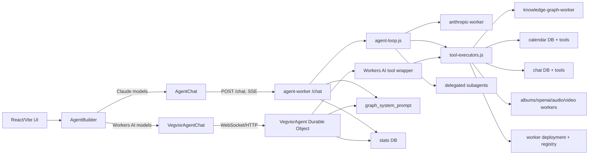
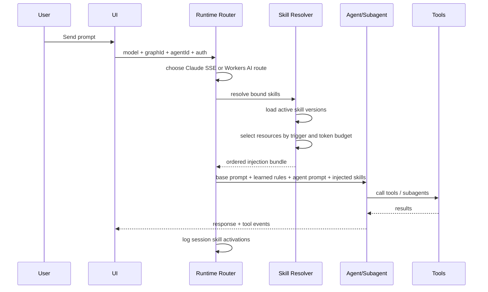

# Agent Builder

Agent Builder is a full-stack agent platform for the Vegvisr ecosystem.
It is not just a chat UI. It combines:

- a React/Vite control plane
- a Cloudflare Worker orchestration layer
- multiple model backends
- delegated subagents
- tool-driven knowledge graph operations
- persistent system learning
- usage and cost tracking

The current implementation is broader than the original foundation roadmap. This README reflects the system as it exists now.

## Project Documentation

- [CLAUDE.md](./CLAUDE.md) — Project-specific Claude Code instructions
- [_project/lessons_learned.md](./_project/lessons_learned.md) — Engineering discipline & failure patterns (read first per response)
- [_project/STATUS.md](./_project/STATUS.md) — Current state & progress log
- [_project/TODO.md](./_project/TODO.md) — Remaining slices
- [_project/PLAN.md](./_project/PLAN.md) — Implementation plan
- [_project/TEST_PLAN.md](./_project/TEST_PLAN.md) — Test regime

## What the system does

Agent Builder lets a user:

- chat with AI agents through multiple model providers
- switch between Claude-style SSE orchestration and Workers AI persistent chat
- read and write Vegvisr knowledge graphs
- create and debug HTML apps stored as graph nodes
- scaffold and deploy new Cloudflare worker capabilities
- route specialist tasks to subagents such as KG, HTML, chat groups, bots, contacts, video, and YouTube graph builders
- persist learned behavior and self-knowledge into the system prompt graph

## Current architecture



## Frontend surfaces

The main shell is [src/components/AgentBuilder.tsx](src/components/AgentBuilder.tsx). It exposes:

- `chat`: main agent interaction
- `graphs`: graph portfolio and graph context switching
- `agents`: agent configuration
- `data`: data explorer
- `usage`: cost and token tracking
- `settings`: model selection

The model switch in [src/components/ModelSettings.tsx](src/components/ModelSettings.tsx) drives runtime routing:

- Workers AI models such as `@cf/meta/llama-4-scout-17b-16e-instruct` and `@cf/google/gemma-4-26b-a4b-it`
- Claude models such as `claude-haiku-4-5-20251001`, `claude-sonnet-4-6`, and `claude-opus-4-6`
- image-generation models
- local Ollama in localhost-only development

When a Workers AI model is selected, the UI uses `VegvisrAgentChat`.
When a Claude model is selected, the UI uses `AgentChat`.

## Runtime paths

### 1. Claude orchestration path

The classic agent path is the SSE-based worker route in [worker/index.js](worker/index.js) and [worker/agent-loop.js](worker/agent-loop.js).

Characteristics:

- single request/response cycle streamed over SSE
- Anthropic-backed orchestration
- tool execution loop with verification rules
- delegated subagents for specialist domains
- fast-path bypass for simple graph listing requests
- session and tool usage tracking

This path is best for:

- longer guided workflows
- heavy tool use
- specialist delegation
- cases where strict orchestration matters more than latency

### 2. Workers AI persistent path

The newer path is [worker/agent.js](worker/agent.js), built on Cloudflare `AIChatAgent`.

Characteristics:

- Durable Object per user
- persistent chat state
- WebSocket/HTTP transport
- Workers AI model execution
- tool wrapping via AI SDK-compatible schemas
- graph-aware argument normalization

This path is best for:

- low-latency chat
- persistent multi-turn model sessions
- cheaper or edge-local model experimentation
- model families that are not on the Anthropic orchestration path

## Tooling and delegation model

The worker is intentionally split into small layers:

- [worker/index.js](worker/index.js): routing and request entrypoints
- [worker/agent-loop.js](worker/agent-loop.js): orchestration loop and policy enforcement
- [worker/tool-definitions.js](worker/tool-definitions.js): tool schemas
- [worker/tool-executors.js](worker/tool-executors.js): runtime implementations
- [worker/openapi-tools.js](worker/openapi-tools.js): dynamic KG OpenAPI tool loading
- [worker/system-prompt.js](worker/system-prompt.js): global operating policy

The orchestrator blocks some low-level tools and forces delegation to specialists where appropriate.
Examples:

- HTML editing goes to the HTML Builder subagent
- graph writing goes to the KG subagent
- chat group operations go to the Chat subagent
- video and stream work goes to the Video subagent

That keeps the main agent thinner and makes specialist prompts easier to evolve independently.

## Persistent system memory

The system already has a form of memory and behavior layering:

- the base policy lives in [worker/system-prompt.js](worker/system-prompt.js)
- dynamic behavior rules are loaded from the `graph_system_prompt` knowledge graph in [worker/index.js](worker/index.js)
- the `save_learning` tool can persist new behavior or self-knowledge back into that graph

This means the system already behaves like a prompt-driven agent platform, not just a static tool caller.

## Current data model

At a high level, the platform currently works across these data domains:

### UI/session state

- current `graphId`
- selected `agentId`
- selected `model`
- active preview HTML and node context
- pending graph context from graph picker

### Agent runtime state

- SSE turn state for Claude path
- Durable Object chat history for Workers AI path
- auth context resolved from Vegvisr auth
- model-specific tool availability

### Knowledge graph state

The Vegvisr knowledge graph is the main content model:

- graphs with metadata
- nodes of types such as `fulltext`, `html-node`, `markdown-image`, `mermaid-diagram`, `cloudflare-video`
- edges between nodes
- version history

### Operational telemetry

The worker tracks:

- session counts
- per-model token usage
- per-tool execution usage
- fast-path sessions
- estimated cost

## Proposed first-class skills layer

This repo is a good candidate for a real skill system.
`skills.sh` should not replace the current tool system. It should become a modular expertise layer on top of it.

### Goal

Add attachable skills that:

- augment prompts and procedures
- influence tool selection and workflow patterns
- can be bound to agents, subagents, or sessions
- can be imported from local folders or external registries
- are logged as runtime context, not hidden prompt magic

### Proposed data model

The exact D1 schema below is the recommended starting point:

```sql
CREATE TABLE skills (
  id TEXT PRIMARY KEY,
  slug TEXT NOT NULL UNIQUE,
  name TEXT NOT NULL,
  description TEXT,
  source_type TEXT NOT NULL,       -- local, github, skills.sh, built_in
  source_url TEXT,
  owner TEXT,
  trust_level TEXT NOT NULL,       -- internal, reviewed, external
  enabled INTEGER NOT NULL DEFAULT 1,
  created_at TEXT NOT NULL,
  updated_at TEXT NOT NULL
);

CREATE TABLE skill_versions (
  id TEXT PRIMARY KEY,
  skill_id TEXT NOT NULL,
  version TEXT NOT NULL,
  entry_path TEXT NOT NULL,        -- usually SKILL.md
  manifest_json TEXT,
  body TEXT NOT NULL,              -- normalized SKILL.md body
  metadata_json TEXT,              -- parsed frontmatter and derived metadata
  checksum TEXT NOT NULL,
  is_active INTEGER NOT NULL DEFAULT 1,
  created_at TEXT NOT NULL,
  FOREIGN KEY (skill_id) REFERENCES skills(id)
);

CREATE TABLE skill_resources (
  id TEXT PRIMARY KEY,
  skill_version_id TEXT NOT NULL,
  path TEXT NOT NULL,
  resource_type TEXT NOT NULL,     -- reference, script, asset, template
  content TEXT,
  checksum TEXT,
  size_bytes INTEGER,
  created_at TEXT NOT NULL,
  FOREIGN KEY (skill_version_id) REFERENCES skill_versions(id)
);

CREATE TABLE agent_skill_bindings (
  id TEXT PRIMARY KEY,
  agent_id TEXT NOT NULL,
  skill_id TEXT NOT NULL,
  binding_scope TEXT NOT NULL,     -- agent, subagent, model-route
  trigger_mode TEXT NOT NULL,      -- always, manual, auto
  priority INTEGER NOT NULL DEFAULT 100,
  config_json TEXT,                -- per-agent overrides, token budget, resource allowlist
  enabled INTEGER NOT NULL DEFAULT 1,
  created_at TEXT NOT NULL,
  updated_at TEXT NOT NULL
);

CREATE TABLE session_skill_activations (
  id TEXT PRIMARY KEY,
  session_id TEXT NOT NULL,
  skill_id TEXT NOT NULL,
  skill_version_id TEXT NOT NULL,
  activation_reason TEXT NOT NULL, -- manual, classifier, agent-binding, user-request
  injection_layer TEXT NOT NULL,   -- system, subagent, task-prefix, resource
  token_budget INTEGER,
  activated_at TEXT NOT NULL,
  metadata_json TEXT
);
```

### Why this schema

- `skills`: identity and source of truth
- `skill_versions`: immutable versioned prompt bodies
- `skill_resources`: optional scripts, references, templates, examples
- `agent_skill_bindings`: which agents or subagents should load which skills
- `session_skill_activations`: observability for what actually entered context

This keeps skill storage separate from chat history and separate from tool definitions.

## Proposed injection flow

The injection flow should be explicit and deterministic.



### Step-by-step

1. The UI sends `agentId`, `model`, `graphId`, auth token, and user message.
2. The router selects runtime:
   - Claude path via `AgentChat` and `/chat`
   - Workers AI path via `VegvisrAgentChat` and Durable Object
3. The runtime resolves base context:
   - base system prompt
   - dynamic `graph_system_prompt` learnings
   - agent-specific prompt
   - current graph context
4. The skill resolver loads all enabled `agent_skill_bindings` for:
   - selected agent
   - selected subagent if delegation happens
   - optionally selected model route
5. The resolver applies trigger logic:
   - `always`: always inject metadata and main body
   - `manual`: inject only if the user explicitly requests it
   - `auto`: inject if the request matches skill description/tags
6. The resolver builds an ordered context package:
   - frontmatter summary first
   - `SKILL.md` core body second
   - only the required resources third
7. The runtime enforces a token budget per skill and per turn.
8. The final prompt stack becomes:
   - global system prompt
   - dynamic learned rules
   - route-specific prompt
   - agent prompt
   - selected skill summaries
   - selected skill bodies
   - selected skill resources
   - user request
9. The runtime logs every injected skill into `session_skill_activations`.
10. If a subagent is invoked, the resolver repeats for the subagent scope.

### Recommended implementation order

1. Add the D1 tables above.
2. Build a `skill-resolver.js` module in `worker/`.
3. Support local import first from a repo folder such as `.codex-skill-staging/`.
4. Add `agent_skill_bindings` support for the Claude SSE path.
5. Mirror the same support in the Workers AI Durable Object path.
6. Add runtime logging and a small admin UI for activations.
7. Only then add external `skills.sh` import and sync.

## Where `skills.sh` fits

`skills.sh` is useful here as:

- a distribution format for specialist procedural knowledge
- a source of reviewed external skills
- a way to keep Remotion, Excalidraw, HTML, or workflow expertise modular

It should not become your execution engine.
Execution should remain:

- your tools
- your workers
- your subagents
- your auth model

Skills should change how the agent thinks and structures work, not how it reaches the database or external services.

## Remotion fit

Remotion fits this architecture well in two places:

### 1. As a skill

Bind a `remotion` skill to:

- a future video-generation agent
- the existing video subagent
- a capability-builder flow when users ask for video scenes or programmatic motion graphics

That would improve:

- composition structure
- timing patterns
- render-safe animation behavior
- asset handling
- text/layout guidance

### 2. As a hosted Vegvisr surface

Yes, a Remotion-based app could reasonably live at `remotion.vegvisr.org`.

Recommended interpretation:

- host a Remotion app, player UI, render UI, or editor-style interface there
- do not treat public production hosting as the same thing as local Remotion Studio

Practical distinction:

- local development: Remotion Studio
- public deployment: a web app using Remotion Player, a custom editor, a render frontend, or a generated showcase surface

For Vegvisr, the best initial deployment shape is probably:

1. `remotion.vegvisr.org` as a React app for previewing and parameterizing compositions
2. rendering triggered by your worker layer
3. generated video metadata saved back into Vegvisr graphs as nodes

## Suggested next moves

1. Implement the proposed skills schema and resolver.
2. Add one internal skill end to end, not many at once.
3. Make `remotion` the first media skill if video generation is a priority.
4. Treat `remotion.vegvisr.org` as a hosted player/editor surface, not as Studio in production.

## Quick start

```bash
npm install
npm run dev
```

## Core files

- `src/components/AgentBuilder.tsx`
- `src/components/AgentChat.tsx`
- `src/components/VegvisrAgentChat.tsx`
- `src/components/ModelSettings.tsx`
- `worker/index.js`
- `worker/agent-loop.js`
- `worker/agent.js`
- `worker/tool-definitions.js`
- `worker/tool-executors.js`
- `worker/system-prompt.js`

## Related references

- Remotion: https://www.remotion.dev/
- Skills directory: https://skills.sh/
- Remotion skill: https://skills.sh/remotion-dev/skills/remotion
